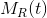

#################################
Data Elements - Resources
#################################

**Any information that can be named can be a resource**

    A resource is a conceptual mapping to a set of entities, **not**
    the entity that corresponds to the mapping at any particular point in time

Fielding defines a resource as "a temporally varying membership function
|equation|, which for time *t* maps to a set of entities, or values"

* A resource's values may be resource identifiers or resource representations.
* Resources can map to an empty set
* Only the identification must be static. A resource's value may be variable or static.

**Resources are identified by resource identifiers**

********************************
Examples
********************************

Can be virtual, non-virtual, or temporal resources.

* Megan, who works in engineering
* The building on the SE corner of 4th and San Jacinto
* All of FooCompany's customers
* The location of our weather balloon
* A sensor's configuration
* The photos from last night's party
* Jim's life insurance policy
* The head of HR
* The latest version of a software package

....

`previous <rest_elements.rst>`_ | `next <data_elements_representations.rst>`_

