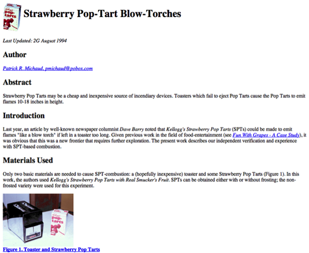
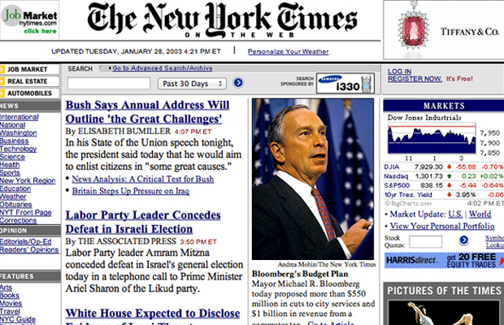

##############
Problem Domain
##############

The web has several defining and emergent characteristics that guided the
development of the REST architectural style.

***********************
Low Barrier to Entry
***********************

* Hypermedia [*]_ is simple and generalizable

  + Arbitrary structuring and relationships

* Content can be authored even when the system is unavailable

  + Targets can be specified before they exist

* Simple text-based protocols drove early adoption

***********************
Extensible
***********************

A website from 1994 [*] :

And one from 1998 [*] :

***********************
Internet Scale
***********************

* Capable of moving data across vast geographic distances reliably
* Capable of moving data across multiple organization boundaries

***********************
Anarchic Scalability
***********************

This means dealing with **unexpected load** and **malicious actors**

* Server pools must be able to be dynamic
* Servers cannot retain client state
* Communications may contain multiple trust boundaries
* Communications must be inspectable (e.g. by firewalls)
* Authentication and authorization data must be able to be transmitted
  along with a communication

***********************
Independent Deployment
***********************

* Fragmented change due to multiple organizational boundaries
* Old and new implementations must co-exist
* Design must account for future extended capabilities
* Deployment must be allowed to be iterative and partial
* Identification and handling of legacy interactions must be possible

....

.. [*] Hypermedia is defined as data that combines application control
       information within or as a layer above presentation information

.. [*] http://mentalfloss.com/article/53792/17-ancient-abandoned-websites-still-work

.. [*] http://justsomething.co/15-famous-websites-and-what-they-looked-like-in-1998/

....

`previous <history.rst>`_ | `next <hypotheses.rst>`_
